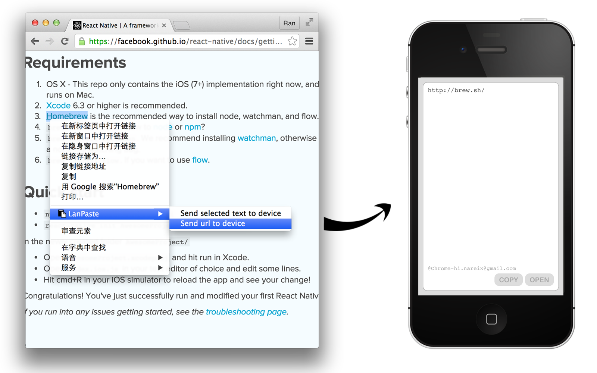
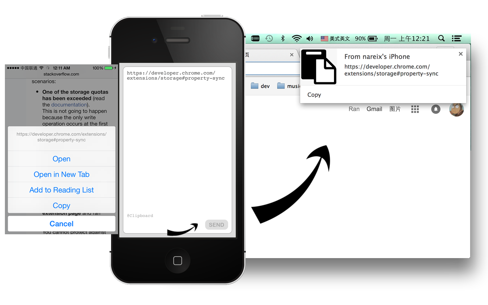

LanPaste
----

Copy & Paste simply across all devices (iOS / Chrome) on local network.

iOS App is build with [React Native](https://github.com/facebook/react-native).





Install
----

Clone this repo
```
git clone git@github.com:nareix/LanPaste.git
cd LanPaste
```

## Build iOS APP

- `cd iosapp`
- `npm install`
- Open `LanPaste.xcodeproj` in `XCode`
- ***change jsCodeLocation variable in `AppDelegate.m` to the one you want***
- Press `Cmd+R` to build it

## Install Chrome app and extension

- Chrome go to Menu -> More tools -> Extensions
- Click the “Developer mode” checkbox and then click the button labeled “Load unpacked extension…”.
- ***Select `chrome-app` folder first.***
- And then `chrome-extension` folder.

